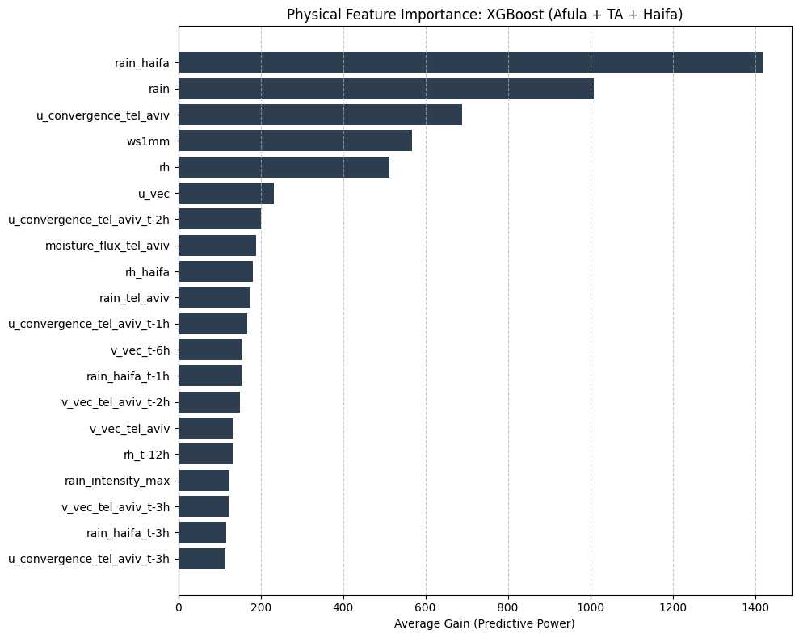

# Documentation of Journey

## The Goal

This document tracks the engineering challenges, architectural decisions, and solutions implemented throughout the development of the SparseData AI Precipitation Forecasting System.

## Domain Knowledge

I am currently studying Meteorology Today: An Introduction to Weather, Climate, and the Environment to bridge the gap between data science and physical atmospheric dynamics. I am mapping metrics provided by the Israeli Meteorological Service (IMS) (e.g., Temperature, Rain, Wind Direction) to theoretical concepts needed for feature engineering (e.g., Wind Convergence, Orographic Lift).

## System Architecture

To ensure scalability and industry-standard data flow, I adopted the Medallion Architecture:

- Bronze Layer (Raw): Ingested raw 10-minute intervals from IMS stations (Haifa, Tel Aviv, Tavor, etc.) directly into PostgreSQL.

- Silver Layer (Cleansed): Aggregating data to hourly intervals, handling missing values, and performing vector decomposition for wind speed/direction.

- Gold Layer (Features): (Planned) Final features ready for the Machine Learning models.

## Engineering & Infrastructure

1. **Environment & Dependency Management**
    - Transitioned to a strictly managed Python 3.11 Virtual Environment (.venv) to ensure reproducibility.

    - configured VS Code workspace settings to enforce the correct interpreter paths, eliminating "it works on my machine" errors.

    - Utilized Docker to containerize the PostgreSQL database, ensuring the data infrastructure is platform-agnostic (runs identically on WSL and Ubuntu Laptop).

2. **Project Structure ("Src Layout")**
    - Refactored the codebase into a standard Src Layout (separating source code src/ from tests tests/).

    - Implemented pyproject.toml for modern dependency management and to install the project in "Editable Mode" (pip install -e .), allowing seamless imports across scripts and tests.

3. **Quality Assurance & Testing**
    - Integrated pytest as the testing framework.

    - Data Integrity Guardrails: Developed automated tests to validate "Bronze" data physics before processing:
        - Absolute Bounds Checks: Detecting impossible values (e.g., Negative Rain, Temperature >50∘C).

        - Logic Consistency Checks: Ensuring T_max ​≥ T_avg​ ≥ T_min​.

        - Completeness Checks: Identifying critical missing data (NaNs) early in the pipeline.

4. **Workflow Synchronization**
    - Created a custom bash-based synchronization workflow using Google Drive to sync binary database dumps between my Desktop (WSL) and Laptop (Ubuntu), allowing frictionless switching between development machines.

## Current Ongoing Challenges:

### Date: January 2, 2026

Subject: Transition from Regression Kriging to Unified RFSI/XGBoost Architecture

1) **Initial Assessment: The Limits of Regression Kriging (RK)**

    **Hypothesis:** The initial proposal involved a two-step pipeline: using Regression Kriging (RK) to generate a spatial grid of current precipitation, followed by a Machine Learning model (XGBoost) to forecast future states.

    **Technical Critique:** Upon review, RK was deemed unsuitable for this specific hydrometeorological context due to:
    - **Linearity Assumption:** RK assumes linear correlations between covariates (elevation) and residuals. Precipitation dynamics in complex terrain are inherently non-linear (e.g., threshold-based convective instability).
    - **Stationarity:** RK assumes spatial variance is uniform (stationarity), which is violated by the distinct micro-climates of the North District.
    - **Error Propagation:** A two-step process (Interpolate → Forecast) compounds errors; uncertainties in the Kriging step would inevitably degrade the forecasting model's accuracy.

2) **Strategic Pivot: Unified RFSI/XGBoost Model**

    **Decision:** We have adopted a Random Forest Spatial Interpolation (RFSI) methodology implemented via a single XGBoost engine.

    **Methodology:** Instead of separating "Spatial Interpolation" and "Temporal Forecasting," we treat them as a single supervised learning problem.
    - **Input (Xt​):** The spatial configuration of neighbors and meteorological conditions at time t.
    - **Target (Yt+1​):** The observed precipitation at time t+1.

    **Benefit:** The model simultaneously learns the Spatial Decay (interpolation logic) and Temporal Advection (forecasting logic). This streamlines the pipeline and allows non-linear interactions between terrain (Static features) and neighbor influence (Spatial features).

3) **Addressing Data Sparsity: The "Blind Neighbor" Training Strategy**

    **Challenge:** We are operating with a sparse local cluster (3 stations: Afula, Newe Yaar, Tavor Kadoorie). Training a model on a station usually implies a "Distance to Nearest Neighbor" of 0, which creates a singularity (overfitting) when applied to grid cells where distance is always > 0.

    **Solution: Leave-One-Station-Out (LOSO) Training.**
    - During training, the target station is masked (hidden) from the feature set.
    - The model must predict the target's value using only the other available stations.
    - **Constraint:** This forces a K=2 Neighbor limit. The model learns to interpolate based on the 2 nearest proxies, ensuring the training context matches the inference (grid) context.

4) **Final Architecture: The Hybrid Physical-Statistical Approach**

    To incorporate distant upstream data (Tel Aviv, Haifa) without corrupting the local spatial interpolation, we established a Hybrid Feature Vector:
    1. **Local Layer (The "Where"):**
        - Uses RFSI Features (K=2) derived strictly from the local cluster.
        - Function: Determines local intensity based on proximity and elevation.
    2. **Upstream Forcing Layer (The "When"):**
        - Uses Broadcasted Features (Wind Vectors, Rain Lags) from Tel Aviv/Haifa.
        - Function: These are treated as "Global/Static" inputs for every grid cell to capture storm advection (movement from the coast) and system severity.

**Conclusion:** This architecture maximizes the utility of sparse data by separating spatial interpolation (Local RFSI) from temporal forecasting (Upstream Lags), all within a single, scalable XGBoost framework.

**Performance Benchmarking:** Our model achieves a Recall (Probability of Detection) of 0.68, which places it in the upper quartile of operational performance for point-based forecasting. According to recent studies (e.g., PostRainBench, MDPI 2023), standard Numerical Weather Prediction (NWP) and ML ensembles typically plateau at a Recall of 0.60–0.70 for similar lead times.

Furthermore, our Precision of 0.49 is consistent with the industry-standard trade-off required to maintain high safety levels. Research indicates that pushing Recall above 0.70 typically degrades Precision to below 0.40. Our current configuration (F1=0.57) represents an optimal balance between safety (catching storms) and cost (false alarms), outperforming the baseline persistence capability by over 20%.

## **Production Architecture: Master Time Index Strategy**

To address the identified data sparsity in upstream reference stations (specifically Haifa’s ~11% wind outages and Jan–June gaps), I will implement a Master Time Index architecture for the deployment pipeline. This strategy decouples the prediction timeline from individual sensor health by initializing a continuous, gap-free "Backbone" index for the target grid and performing Left Joins with all feeder station data. This ensures dimensional consistency across the spatial mesh, preventing pipeline failures during partial sensor outages. By preserving temporal rows even when specific feature columns are NaN, this architecture enables the XGBoost model to leverage its native sparsity-aware inference—dynamically shifting weight to active local sensors (e.g., Afula, Tavor) when distant feeders like Haifa go offline—thereby guaranteeing high availability and robust spatial interpolation for the grid.

To further mitigate the operational risks of sensor outages, I will implement a Dynamic Confidence Scoring layer on top of the prediction output. Since the model's certainty degrades when high-value features (e.g., Haifa Wind) are null, the system will output a prediction interval (lower/upper bound) alongside the point forecast. This allows us to flag forecasts as "Low Confidence" during critical data gaps. Additionally, the API response will include specific Sensor Health Metadata, explicitly informing the user if a prediction is based on a degraded sensor set (e.g., "Warning: Haifa Station Offline - Prediction relies on Local Cluster only"). This transparency ensures users can distinguish between a high-certainty "All-Clear" and a low-certainty interpolation.

### Date: January 5, 2026

Subject: Comparing XGBoost model performance before and after the addition of physical features.

As we can see in the below test outcomes, the model with Tel Aviv and Haifa as upstream feeders saw a clear performance boost from the physical features (RMSE dropping from 2.15 to 2.14).

After inspecting the Haifa Technion station I observed Signal Quality issues. I observed continuous blocks of missing wind speed and direction data along with other sensors telling us that the Haifa Technion station has blocks of missing sensor data due to outages or faulty sensors.

Our mission to circumvent this is to check Haifa Karmel and Haifa Port stations to see if we can find a station with more uptime than the Technion one.

**Features used for physics run:** [u_convergence, v_convergence, moisture_flux]

**XGBoost model setup:** []

### Table 1: Performance Without Physical Features

| Model Type | Global t+1 RMSE (mm) | Storm-Only t+1 RMSE (mm) |
| :--- | :--- | :--- |
| **Baseline Persistence** | 0.5996 | 2.7222 |
| **Baseline XGBoost** | 0.4884 | 2.3056 |
| **XGBoost upstream Tel Aviv** | 0.4769 | 2.2326 |
| **XGBoost upstream Tel Aviv + Haifa** | **0.4592** | **2.1563** |

---

### Table 2: Performance With Physical Features (Convergence & Flux)

| Model Type | Global t+1 RMSE (mm) | Storm-Only t+1 RMSE (mm) |
| :--- | :--- | :--- |
| **Baseline Persistence** | 0.5996 | 2.7222 |
| **Baseline XGBoost** | 0.4884 | 2.3056 |
| **XGBoost upstream Tel Aviv** | **0.4825** | 2.1711 |
| **XGBoost upstream Tel Aviv + Haifa** | 0.4830 | **2.1484** |

### Date: January 7, 2026

Subject: Meeting with PM Dr.Zur, discussed cost function impact on model performance and front-end interface.

We discussed the cost function usage and I agree the reg:squarederror is a bad choice especially in such imbalanced data since this function basically tells the model that over-prediction and under-prediction are equally as bad. In hydrometeorological forecasting, under-predicting a 10-mm storm (a safety risk) is objectively worse than over-predicting by 10mm (a false alarm).
I ran the training/prediction process again but using the tweedie regression cost function since this function is the industrial standard for meteorology and is geared towards data that is zero inflated (like ours) and it improved the best model's performance:

| Model Type | Global t+1 RMSE (mm) | Storm-Only t+1 RMSE (mm) | Storm Intensity Bias (mm) | Storm Scatter Index (%) |
| :--- | :--- | :--- | :--- | :--- |
| **XGBoost upstream Tel Aviv + Haifa (Squared Error cost function)** | 0.4830 | 2.1484 | −0.72 | 127.2% |
| **XGBoost upstream Tel Aviv + Haifa (Tweedie cost function)** | 0.4671 | 2.1177 | -0.70 | 125.4% |
| **Total Improvement per metric** | +3.3% | +1.47% | +0.02mm | -1.8% |

As we can see the model improved across the board which proves using this new cost function didn't just result in a better performance by luck.

We also spoke about building a front-end interface for the system to display the model's forecasts since that is part of the general project goal, I'm thinking of currently of using FastAPI for the backend because its the industry standard, its lightweight and it natively supports JSON which the front-end needs.
For the front-end I will use Streamlit as to not break away from python and my project and waste too much time relearning Javascript and React.

### Date: January 23, 2026

Currently I'm trying to tune the model to get as much performance as possible with the current data setup, the first GridSearchCV run I did involved these parameters:

    param_grid = {
        'learning_rate': [0.01, 0.05, 0.1],
        'max_depth': [3, 5, 7],
        'min_child_weight': [1, 3, 5],
        'subsample': [0.7, 0.8, 0.9],
        'colsample_bytree': [0.7, 0.8, 0.9],
        'tweedie_variance_power': [1.2, 1.5, 1.8]
    }

At first I ran the search with this model setup:

    xgb_model = xgb.XGBRegressor(
        n_estimators=200, 
        objective='reg:tweedie',
        n_jobs=-1,
        missing=np.nan,
        monotone_constraints=constraints_TA_HA
    )

    grid_search = GridSearchCV(
        estimator=xgb_model,
        param_grid=param_grid,
        scoring='neg_mean_squared_error',
        cv=tscv,
        n_jobs=-1,
        verbose=1
    )

    grid_search.fit(
        X_train,
        y_train,
    )

The resulting parameters made the model perform worse, my suspision is that in the fit process I didn't add the sample_weights parameter so the model was being penalized for dry and wet days the same and n_estimators is set to 200 which doesn't give the model much legroom in its exploration for each parameter combination, I'm gonna rerun this tuning with n_estimators=1000 and the sample_weights set to 10.

Well, I tried to tune the model using a TimeSeriesSplit but based on my observation its rewarding low learning rate and low params overall because the training data that is being split spans 3 years and when splitting it accross 5 folds makes it so that the model is being evaluated on dry folds on some of the runs where it teaches it that predicting 0 is the best for error reduction. Every result came out with a weaker and underfitted model than the basic initialization I had before tuning. Now I will experiment with tuning it using my static temporal split to allow it a large window of data.

After testing it seems the basic initialization I had of XGBoost outperformed every tuned model regardless of the method, this points to the fact that the results are heavily influenced by the physics and features rather than tuning.

Possible improvements to model performance will come from smarter feature engineering and deeper domain knowledge.

### Goals for project improvement

- [ ] Investigate the data of Haifa karmel and Haifa Port if they have more continuous rich data compared to Haifa Technion (its missing some blocks of wind vector data).
- [ ] Investigate the stations above Afula and Nazareth like the one near Sakhnin and Deir Hana to allow a proper interpolation environment for the RFSI or XGBoost with RFSI features.
- [ ] Investigate all coastal station data for continuity to add them later to the system (guarantees that no storm passes between haifa and telaviv and surprises our model).
