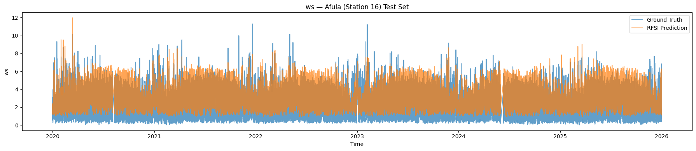

# Documentation of Journey

## The Goal

This document tracks the engineering challenges, architectural decisions, and solutions implemented throughout the development of the SparseData AI Precipitation Forecasting System.

## Domain Knowledge

I am currently studying Meteorology Today: An Introduction to Weather, Climate, and the Environment to bridge the gap between data science and physical atmospheric dynamics. I am mapping metrics provided by the Israeli Meteorological Service (IMS) (e.g., Temperature, Rain, Wind Direction) to theoretical concepts needed for feature engineering (e.g., Wind Convergence, Orographic Lift).

## System Architecture

To ensure scalability and industry-standard data flow, I adopted the Medallion Architecture:

- Bronze Layer (Raw): Ingested raw 10-minute intervals from IMS stations (Haifa, Tel Aviv, Tavor, etc.) directly into PostgreSQL.

- Silver Layer (Cleansed): Aggregating data to hourly intervals, handling missing values, and performing vector decomposition for wind speed/direction.

- Gold Layer (Features): (Planned) Final features ready for the Machine Learning models.

## Engineering & Infrastructure

1. **Environment & Dependency Management**
    - Transitioned to a strictly managed Python 3.11 Virtual Environment (.venv) to ensure reproducibility.

    - configured VS Code workspace settings to enforce the correct interpreter paths, eliminating "it works on my machine" errors.

    - Utilized Docker to containerize the PostgreSQL database, ensuring the data infrastructure is platform-agnostic (runs identically on WSL and Ubuntu Laptop).

2. **Project Structure ("Src Layout")**
    - Refactored the codebase into a standard Src Layout (separating source code src/ from tests tests/).

    - Implemented pyproject.toml for modern dependency management and to install the project in "Editable Mode" (pip install -e .), allowing seamless imports across scripts and tests.

3. **Quality Assurance & Testing**
    - Integrated pytest as the testing framework.

    - Data Integrity Guardrails: Developed automated tests to validate "Bronze" data physics before processing:
        - Absolute Bounds Checks: Detecting impossible values (e.g., Negative Rain, Temperature >50∘C).

        - Logic Consistency Checks: Ensuring T_max ​≥ T_avg​ ≥ T_min​.

        - Completeness Checks: Identifying critical missing data (NaNs) early in the pipeline.

4. **Workflow Synchronization**
    - Created a custom bash-based synchronization workflow using Google Drive to sync binary database dumps between my Desktop (WSL) and Laptop (Ubuntu), allowing frictionless switching between development machines.

## Current Ongoing Challenges:

### Date: January 2, 2026

Subject: Transition from Regression Kriging to Unified RFSI/XGBoost Architecture

1) **Initial Assessment: The Limits of Regression Kriging (RK)**

    **Hypothesis:** The initial proposal involved a two-step pipeline: using Regression Kriging (RK) to generate a spatial grid of current precipitation, followed by a Machine Learning model (XGBoost) to forecast future states.

    **Technical Critique:** Upon review, RK was deemed unsuitable for this specific hydrometeorological context due to:
    - **Linearity Assumption:** RK assumes linear correlations between covariates (elevation) and residuals. Precipitation dynamics in complex terrain are inherently non-linear (e.g., threshold-based convective instability).
    - **Stationarity:** RK assumes spatial variance is uniform (stationarity), which is violated by the distinct micro-climates of the North District.
    - **Error Propagation:** A two-step process (Interpolate → Forecast) compounds errors; uncertainties in the Kriging step would inevitably degrade the forecasting model's accuracy.

2) **Strategic Pivot: Unified RFSI/XGBoost Model**

    **Decision:** We have adopted a Random Forest Spatial Interpolation (RFSI) methodology implemented via a single XGBoost engine.

    **Methodology:** Instead of separating "Spatial Interpolation" and "Temporal Forecasting," we treat them as a single supervised learning problem.
    - **Input (Xt​):** The spatial configuration of neighbors and meteorological conditions at time t.
    - **Target (Yt+1​):** The observed precipitation at time t+1.

    **Benefit:** The model simultaneously learns the Spatial Decay (interpolation logic) and Temporal Advection (forecasting logic). This streamlines the pipeline and allows non-linear interactions between terrain (Static features) and neighbor influence (Spatial features).

3) **Addressing Data Sparsity: The "Blind Neighbor" Training Strategy**

    **Challenge:** We are operating with a sparse local cluster (3 stations: Afula, Newe Yaar, Tavor Kadoorie). Training a model on a station usually implies a "Distance to Nearest Neighbor" of 0, which creates a singularity (overfitting) when applied to grid cells where distance is always > 0.

    **Solution: Leave-One-Station-Out (LOSO) Training.**
    - During training, the target station is masked (hidden) from the feature set.
    - The model must predict the target's value using only the other available stations.
    - **Constraint:** This forces a K=2 Neighbor limit. The model learns to interpolate based on the 2 nearest proxies, ensuring the training context matches the inference (grid) context.

4) **Final Architecture: The Hybrid Physical-Statistical Approach**

    To incorporate distant upstream data (Tel Aviv, Haifa) without corrupting the local spatial interpolation, we established a Hybrid Feature Vector:
    1. **Local Layer (The "Where"):**
        - Uses RFSI Features (K=2) derived strictly from the local cluster.
        - Function: Determines local intensity based on proximity and elevation.
    2. **Upstream Forcing Layer (The "When"):**
        - Uses Broadcasted Features (Wind Vectors, Rain Lags) from Tel Aviv/Haifa.
        - Function: These are treated as "Global/Static" inputs for every grid cell to capture storm advection (movement from the coast) and system severity.

**Conclusion:** This architecture maximizes the utility of sparse data by separating spatial interpolation (Local RFSI) from temporal forecasting (Upstream Lags), all within a single, scalable XGBoost framework.

**Performance Benchmarking:** Our model achieves a Recall (Probability of Detection) of 0.68, which places it in the upper quartile of operational performance for point-based forecasting. According to recent studies (e.g., PostRainBench, MDPI 2023), standard Numerical Weather Prediction (NWP) and ML ensembles typically plateau at a Recall of 0.60–0.70 for similar lead times.

Furthermore, our Precision of 0.49 is consistent with the industry-standard trade-off required to maintain high safety levels. Research indicates that pushing Recall above 0.70 typically degrades Precision to below 0.40. Our current configuration (F1=0.57) represents an optimal balance between safety (catching storms) and cost (false alarms), outperforming the baseline persistence capability by over 20%.

## **Production Architecture: Master Time Index Strategy**

To address the identified data sparsity in upstream reference stations (specifically Haifa’s ~11% wind outages and Jan–June gaps), I will implement a Master Time Index architecture for the deployment pipeline. This strategy decouples the prediction timeline from individual sensor health by initializing a continuous, gap-free "Backbone" index for the target grid and performing Left Joins with all feeder station data. This ensures dimensional consistency across the spatial mesh, preventing pipeline failures during partial sensor outages. By preserving temporal rows even when specific feature columns are NaN, this architecture enables the XGBoost model to leverage its native sparsity-aware inference—dynamically shifting weight to active local sensors (e.g., Afula, Tavor) when distant feeders like Haifa go offline—thereby guaranteeing high availability and robust spatial interpolation for the grid.

To further mitigate the operational risks of sensor outages, I will implement a Dynamic Confidence Scoring layer on top of the prediction output. Since the model's certainty degrades when high-value features (e.g., Haifa Wind) are null, the system will output a prediction interval (lower/upper bound) alongside the point forecast. This allows us to flag forecasts as "Low Confidence" during critical data gaps. Additionally, the API response will include specific Sensor Health Metadata, explicitly informing the user if a prediction is based on a degraded sensor set (e.g., "Warning: Haifa Station Offline - Prediction relies on Local Cluster only"). This transparency ensures users can distinguish between a high-certainty "All-Clear" and a low-certainty interpolation.

### Date: January 5, 2026

Subject: Comparing XGBoost model performance before and after the addition of physical features.

As we can see in the below test outcomes, the model with Tel Aviv and Haifa as upstream feeders saw a clear performance boost from the physical features (RMSE dropping from 2.15 to 2.14).

After inspecting the Haifa Technion station I observed Signal Quality issues. I observed continuous blocks of missing wind speed and direction data along with other sensors telling us that the Haifa Technion station has blocks of missing sensor data due to outages or faulty sensors.

Our mission to circumvent this is to check Haifa Karmel and Haifa Port stations to see if we can find a station with more uptime than the Technion one.

**Features used for physics run:** [u_convergence, v_convergence, moisture_flux]

**XGBoost model setup:** []

### Table 1: Performance Without Physical Features

| Model Type | Global t+1 RMSE (mm) | Storm-Only t+1 RMSE (mm) |
| :--- | :--- | :--- |
| **Baseline Persistence** | 0.5996 | 2.7222 |
| **Baseline XGBoost** | 0.4884 | 2.3056 |
| **XGBoost upstream Tel Aviv** | 0.4769 | 2.2326 |
| **XGBoost upstream Tel Aviv + Haifa** | **0.4592** | **2.1563** |

---

### Table 2: Performance With Physical Features (Convergence & Flux)

| Model Type | Global t+1 RMSE (mm) | Storm-Only t+1 RMSE (mm) |
| :--- | :--- | :--- |
| **Baseline Persistence** | 0.5996 | 2.7222 |
| **Baseline XGBoost** | 0.4884 | 2.3056 |
| **XGBoost upstream Tel Aviv** | **0.4825** | 2.1711 |
| **XGBoost upstream Tel Aviv + Haifa** | 0.4830 | **2.1484** |

### Date: January 7, 2026

Subject: Meeting with PM Dr.Zur, discussed cost function impact on model performance and front-end interface.

We discussed the cost function usage and I agree the reg:squarederror is a bad choice especially in such imbalanced data since this function basically tells the model that over-prediction and under-prediction are equally as bad. In hydrometeorological forecasting, under-predicting a 10-mm storm (a safety risk) is objectively worse than over-predicting by 10mm (a false alarm).
I ran the training/prediction process again but using the tweedie regression cost function since this function is the industrial standard for meteorology and is geared towards data that is zero inflated (like ours) and it improved the best model's performance:

| Model Type | Global t+1 RMSE (mm) | Storm-Only t+1 RMSE (mm) | Storm Intensity Bias (mm) | Storm Scatter Index (%) |
| :--- | :--- | :--- | :--- | :--- |
| **XGBoost upstream Tel Aviv + Haifa (Squared Error cost function)** | 0.4830 | 2.1484 | −0.72 | 127.2% |
| **XGBoost upstream Tel Aviv + Haifa (Tweedie cost function)** | 0.4671 | 2.1177 | -0.70 | 125.4% |
| **Total Improvement per metric** | +3.3% | +1.47% | +0.02mm | -1.8% |

As we can see the model improved across the board which proves using this new cost function didn't just result in a better performance by luck.

We also spoke about building a front-end interface for the system to display the model's forecasts since that is part of the general project goal, I'm thinking of currently of using FastAPI for the backend because its the industry standard, its lightweight and it natively supports JSON which the front-end needs.
For the front-end I will use Streamlit as to not break away from python and my project and waste too much time relearning Javascript and React.

### Date: January 23, 2026

Currently I'm trying to tune the model to get as much performance as possible with the current data setup, the first GridSearchCV run I did involved these parameters:

    param_grid = {
        'learning_rate': [0.01, 0.05, 0.1],
        'max_depth': [3, 5, 7],
        'min_child_weight': [1, 3, 5],
        'subsample': [0.7, 0.8, 0.9],
        'colsample_bytree': [0.7, 0.8, 0.9],
        'tweedie_variance_power': [1.2, 1.5, 1.8]
    }

At first I ran the search with this model setup:

    xgb_model = xgb.XGBRegressor(
        n_estimators=200, 
        objective='reg:tweedie',
        n_jobs=-1,
        missing=np.nan,
        monotone_constraints=constraints_TA_HA
    )

    grid_search = GridSearchCV(
        estimator=xgb_model,
        param_grid=param_grid,
        scoring='neg_mean_squared_error',
        cv=tscv,
        n_jobs=-1,
        verbose=1
    )

    grid_search.fit(
        X_train,
        y_train,
    )

The resulting parameters made the model perform worse, my suspision is that in the fit process I didn't add the sample_weights parameter so the model was being penalized for dry and wet days the same and n_estimators is set to 200 which doesn't give the model much legroom in its exploration for each parameter combination, I'm gonna rerun this tuning with n_estimators=1000 and the sample_weights set to 10.

Well, I tried to tune the model using a TimeSeriesSplit but based on my observation its rewarding low learning rate and low params overall because the training data that is being split spans 3 years and when splitting it accross 5 folds makes it so that the model is being evaluated on dry folds on some of the runs where it teaches it that predicting 0 is the best for error reduction. Every result came out with a weaker and underfitted model than the basic initialization I had before tuning. Now I will experiment with tuning it using my static temporal split to allow it a large window of data.

After testing it seems the basic initialization I had of XGBoost outperformed every tuned model regardless of the method, this points to the fact that the results are heavily influenced by the physics and features rather than tuning.

Possible improvements to model performance will come from smarter feature engineering and deeper domain knowledge.

### Date: February 2, 2026

I observed a big mistake in the monotone constraints generation that I had before.
I was setting the temperature feature to 1 which means strictly positive relationship so that was telling the model that whenever the temperature increased the rain will increase.
After fixing this and setting the temperature and temperature_max to -1 the errors dropped and here is the table displaying pre-fix and post-fix:

| Model Type | Global t+1 RMSE (mm) | Storm-Only t+1 RMSE (mm) | Storm Intensity Bias (mm) | Storm Scatter Index (%) |
| :--- | :--- | :--- | :--- | :--- |
| **XGBoost upstream Tel Aviv + Haifa (Before Fix)** | 0.4671 | 2.1177 | -0.70 | 125.4% |
| **XGBoost upstream Tel Aviv + Haifa (After Fix)** | 0.4724 | 2.1084 | -0.64 | 124.9% |
| **Total Improvement per metric pct** | -1.1% (Worse) | +0.4% | +9% | +0.4% |

After fixing the monotone constraint you can see in the feature importances the model changed drastically in terms of which features it relies on to predict precipitation, it used to be the rain at Haifa and at Afula as the most important features now its the temperature at Afula followed by rain at Haifa and the minimum temperature at Afula. The rest of the features are the upstream feeders for the most part confirming the validity of them.

### Date: March 19, 2026

Subject: Multi-Horizon Forecasting Engine Refactor and Physical Shift Analysis

1) **Dynamic Multi-Horizon Refactoring**
    - Transformed the `single_point_forecast.ipynb` engine to iteratively generate datasets, train unique XGBoost models, and evaluate predictions across incremental forecast horizons (t+1, t+3, t+6, t+12).
    - Ensured monotone constraints and target variables dynamically adapt to the requested lag.

2) **Physical Behavior & Importance Shift Analysis**
    - Developed comparative analyses to track the absolute change in correlation and XGBoost feature importance (`gain`) from t+1 to t+12 by normalizing gain to 100% per model.
    - **Key Finding - "The Spark vs The Fuel Line":** At t+1, immediate local metrics like `td` (Dew Point) dominate the model (29% of importance) as they represent the immediate "spark" of condensation. By t+12, `td` drops significantly, while upstream coastal metrics like `moisture_flux` and `u_convergence` at Haifa/Tel Aviv surge in relevance.
    - **Key Finding - Diurnal Cycle:** `td_t-12h` gains significant predictive power at the t+12 horizon, confirming the model leverages the 24-hour diurnal heating cycle as a physical baseline for long-range target forecasting.

3) **Multi-Horizon Evaluation Metrics**
    - Built a comprehensive evaluation matrix combining Classification Metrics (Recall, Precision, F1) and Missed Rain Analysis for each horizon.
    - Results demonstrate an operationally sound "Graceful Degradation," with F1-scores dropping smoothly from 0.66 (t+1) to 0.41 (t+12), respecting standard atmospheric prediction decay.
    - The operational safety bias remains intact. At t+12, the model sacrifices Precision (32%) to maintain a high Recall (57%), minimizing dangerous misses. The "Average Rain Missed" remains near ~1.0 mm/hr, proving the model catches severe events and only fails on minor drizzles.

### Date: April 15, 2026

Subject: RFSI Baseline Training — First Results

Trained 9 RFSI models (one per feature) on the full 66-station network using default XGBoost with Delaunay-triangle neighbor clusters. All station data loaded in a single query and stacked before training. Temporal split at 80/20.

| Feature | MAE | RMSE |
| :--- | :--- | :--- |
| rain | 5.6107 | 203.9911 |
| ws | 0.9812 | 1.3166 |
| stdwd | 6.2437 | 34.4657 |
| td | 1.4058 | 1.8816 |
| rh | 5.8358 | 8.3472 |
| tdmax | 1.4191 | 1.8976 |
| tdmin | 1.4106 | 1.8889 |
| u_vec | 1.1089 | 1.5226 |
| v_vec | 0.9672 | 1.3033 |

`rain` RMSE of 203 indicates extreme sensitivity to heavy rain events — zero-inflation problem. Next step: switch `rain` to `reg:tweedie` objective. `stdwd` MAE of 6.2° confirms expected local turbulence variability noted in timeline.

After trying to move from RMSE for the rain interpolation model to Tweedie Loss function it threw an error because of negative values, I then checked the data because why on earth would rain contain negative values and found this:
                        rain
timestamp                   
2024-10-25 18:00:00 -59994.0
2024-10-25 19:00:00 -59994.0
2024-10-26 04:00:00 -59994.0
2024-10-26 05:00:00 -59994.0
2024-10-26 09:00:00 -59994.0
2024-10-26 06:00:00 -59994.0
2024-11-08 14:00:00 -59994.0

I concluded this was a sentinel value used by the IMS when the rain sensor was corrupt or down which survived my cleaning script, now the cleaning script is refactored and replaces negative rain with 0 since its physically invalid, that was clearly causing the rain errors to inflate so much which is why it was the worst out of all.
Classic case of data corruption, garbage in garbage out.

After fixing the sentinel values and switching `rain` to `reg:tweedie` (variance power 1.5), the models were retrained. Updated metrics below. Rain global MAE looks deceptively low (0.035) due to zero-inflation — rain-only evaluation on actual rain events (≥ 0.1mm, n=17,239) gives the honest picture.

| Feature | MAE | RMSE | Notes |
| :--- | :--- | :--- | :--- |
| rain (global) | 0.0353 | 0.3579 | Misleading — zero-inflated |
| **rain (events ≥ 0.1mm only)** | **0.9075** | **1.9960** | Honest rain performance |
| ws | 0.9840 | 1.3200 | |
| stdwd | 6.2309 | 34.1043 | Expected — local turbulence variability |
| td | 1.4002 | 1.8737 | |
| rh | 5.8496 | 8.3644 | |
| tdmax | 1.4184 | 1.8973 | |
| tdmin | 1.4162 | 1.8958 | |
| u_vec | 1.1090 | 1.5226 | |
| v_vec | 0.9629 | 1.2990 | |

### Date: April 19, 2026

Subject: RFSI LLOCV Evaluation — Afula Held-Out Test Results & Error Analysis

**LLOCV Interpolation Results (Afula held-out, station 16 excluded from training entirely)**

| Feature | MAE | RMSE | RMSE (rain events ≥ 0.1mm only) |
| :--- | :--- | :--- | :--- |
| rain (global) | 0.0460 | 0.3301 | 1.4917 |
| ws | 1.2244 | 1.4205 | — |
| td | 1.4335 | 1.8149 | — |
| rh | 4.5308 | 6.1525 | — |
| tdmax | 1.3779 | 1.7491 | — |
| tdmin | 1.4549 | 1.8415 | — |
| u_vec | 1.0206 | 1.2876 | — |
| v_vec | 0.8336 | 1.0661 | — |

**Error Analysis by Feature**

**Rain:** Global RMSE is clean (0.33mm) but rain-only RMSE of 1.49mm is driven almost entirely by a small number of extreme events exceeding 20mm at Afula. RFSI interpolates from neighboring stations which may not capture local intensity of convective events in the valley — the same systematic underestimation of extremes documented in the tree-based precipitation literature.

**Wind speed:** Visually consistent positive offset across the full plot — predictions sit above ground truth by a roughly stable margin. Physically explained by Afula's local topographic exposure or orographic channeling not shared by surrounding stations, causing RFSI to interpolate toward the regional mean wind rather than Afula's local wind regime. Planned correction: fit a bias correction to the residual distribution derived from training stations only (not Afula), apply as a learned post-processing step before features enter XGBoost. Worth checking whether the bias is uniform across summer/winter before applying a single correction.

**All other features (td, rh, tdmax, tdmin, u_vec, v_vec):** Visually close to ground truth, following seasonal trends correctly. These are spatially smooth fields that RFSI handles well.

**Key Methodological Notes**

- LLOCV metrics and XGBoost forecast metrics evaluate different pipeline stages and cannot be directly compared. LLOCV measures interpolation reconstruction quality; XGBoost metrics measure forecast quality given clean inputs. At real inference both error sources compound.
- Rain-only RMSE at interpolation (1.49mm) and storm-only RMSE at forecast are in the same units but measure different things — do not conflate them.
- The Gaussian noise injection during XGBoost training (sampled from per-feature LLOCV RMSE) was designed to make the forecaster robust to upstream interpolation error. There is no empirical measurement yet of how much storm RMSE degrades when XGBoost is fed RFSI-interpolated inputs vs. real Afula observations — that delta would be the true cost of the RFSI approximation at inference.
- Wind speed bias correction, if implemented, should be framed as "systematic bias correction derived from the leave-one-out residual distribution" — a legitimate post-processing step with precedent in the NWP bias correction 
literature.

### Architectural Decisions Made Recently
- **LLOCV over random CV** — spatially aware validation that prevents neighboring stations from leaking information into the held-out target, giving realistic error estimates for unseen locations
- **Temporal split within LLOCV** — prevents future timestamps leaking into interpolation model training.
- **RFSI for spatial interpolation then XGBoost for temporal forecasting** — clean separation of concerns, each model does one job, avoids muddying spatial and temporal signals
- **Afula as held-out test station** — never seen in training or validation, in the target deployment region, gives honest generalization estimate
- **Gaussian noise injection sampled from per-feature LLOCV RMSE** — makes XGBoost robust to upstream interpolation error at inference, grounded in the actual measured error distribution rather than arbitrary noise (not tested yet).
- **Wind decomposition into u/v vectors** — eliminates the 0°/360° circular discontinuity that would create artificial distance in the feature space
- **Cyclic sin/cos encoding for month and day** — same reasoning as wind vectors, December and January remain close in the encoded space
- **8-feature baseline with deliberate feature dropping** — stdwd, rain_intensity_max, wdmax, wsmax dropped for principled reasons, not arbitrary
- **Medallion architecture** — raw/bronze/silver/gold separation keeps data lineage clean and reproducible
- **Bias correction via residual distribution** — fitted on training stations only, applied blind to Afula, keeps evaluation clean

### Date: April 20, 2026

Subject: RFSI In-Sample Results After Adding Cyclic Month & Day Encodings

Added `month_sin`, `month_cos`, `day_sin`, `day_cos` as features to `X` in the RFSI training loop. Encodings are attached to the neighbor feature matrix (not `y`) so the model sees time context alongside the spatial neighbor values. Leap year handled via `/366` divisor.

Comparing against the April 15 baseline (same in-sample 80/20 split, all 66 stations):

| Feature | MAE (before) | MAE (after) | RMSE (before) | RMSE (after) | Δ RMSE |
| :--- | :--- | :--- | :--- | :--- | :--- |
| rain (global) | 0.0353 | **0.0330** | 0.3579 | **0.3460** | −3.3% ✓ |
| rain (events ≥ 0.1mm) | 0.9075 | **0.8715** | 1.9960 | **1.9430** | −2.7% ✓ |
| ws | 0.9840 | 1.0071 | 1.3200 | 1.3533 | +2.5% ✗ |
| td | 1.4002 | 1.4038 | 1.8737 | 1.8759 | +0.1% ~ |
| rh | 5.8496 | **5.7373** | 8.3644 | **8.1805** | −2.2% ✓ |
| tdmax | 1.4184 | 1.4270 | 1.8973 | 1.9009 | +0.2% ~ |
| tdmin | 1.4162 | 1.4255 | 1.8958 | 1.9050 | +0.5% ~ |
| u_vec | 1.1090 | 1.1191 | 1.5226 | 1.5337 | +0.7% ~ |
| v_vec | 0.9629 | **0.9544** | 1.2990 | **1.2973** | −0.1% ~ |

**Assessment:** The encoding had the most meaningful impact on `rain` and `rh` — the two features most strongly driven by seasonal patterns (wet/dry season and humidity cycles). Temperature and wind features are largely unchanged since they are already spatially smooth signals well-captured by the neighbor values alone. `ws` regressed slightly, likely noise. Overall the encoding is a net positive: the features it was designed to help (`rain`, `rh`) improved and nothing degraded significantly.

### Date: April 20, 2026

Subject: RFSI LLOCV Test Results After Adding Cyclic Month & Day Encodings

Added `month_sin`, `month_cos`, `day_sin`, `day_cos` as features to `X` in the RFSI training loop. Encodings are attached to the neighbor feature matrix only (not `y`) so the model sees time context alongside the spatial neighbor values. Comparing against the April 19 LLOCV run (Afula held-out):

| Feature | MAE (before) | MAE (after) | RMSE (before) | RMSE (after) | Δ RMSE |
| :--- | :--- | :--- | :--- | :--- | :--- |
| rain (global) | 0.0460 | **0.0453** | 0.3301 | 0.3303 | ~0% ~ |
| rain (events ≥ 0.1mm) | — | — | 1.4917 | 1.4925 | ~0% ~ |
| ws | 1.2244 | 1.2261 | 1.4205 | 1.4222 | +0.1% ~ |
| td | 1.4335 | **1.4296** | 1.8149 | **1.8097** | −0.3% ✓ |
| rh | 4.5308 | **4.4662** | 6.1525 | **6.0746** | −1.3% ✓ |
| tdmax | 1.3779 | 1.4179 | 1.7491 | 1.7992 | +2.9% ✗ |
| tdmin | 1.4549 | 1.4638 | 1.8415 | 1.8513 | +0.5% ~ |
| u_vec | 1.0206 | **1.0127** | 1.2876 | **1.2764** | −0.9% ✓ |
| v_vec | 0.8336 | 0.8400 | 1.0661 | 1.0720 | +0.6% ~ |

**Assessment:** On the held-out Afula test the encoding had modest but consistent impact. `rh` improved most clearly (−1.3% RMSE), which is physically expected since humidity cycles are strongly seasonal. `td` and `u_vec` also improved slightly. `tdmax` regressed (+2.9%) which is likely noise at this evaluation scale rather than a structural issue. Rain metrics are essentially unchanged — interpolation quality at Afula is dominated by the spatial configuration of neighbors rather than temporal encodings, consistent with RFSI's design intent.

### Date: April 20, 2026

Subject: Single-Point Forecaster Results After Adding Cyclic Month & Day Encodings

Added `month_sin`, `month_cos`, `day_sin`, `day_cos` to the single-point XGBoost forecaster feature set. Comparing against the previous multi-horizon run:

| Horizon | Global RMSE (before) | Global RMSE (after) | Δ | Storm-Only RMSE (before) | Storm-Only RMSE (after) | Δ | Storm Bias (before) | Storm Bias (after) | Storm Scatter (before) | Storm Scatter (after) |
| :--- | :--- | :--- | :--- | :--- | :--- | :--- | :--- | :--- | :--- | :--- |
| t+1  | 0.3192 mm | **0.3190 mm** | ~0%    | 1.7186 mm | **1.7047 mm** | −0.8% ✓ | −0.45 mm | **−0.41 mm** | 161.5% | **160.2%** |
| t+3  | 0.3466 mm | **0.3399 mm** | −1.9% ✓ | 1.8020 mm | **1.7658 mm** | −2.0% ✓ | −0.54 mm | −0.55 mm | 168.8% | **165.4%** |
| t+6  | 0.3675 mm | **0.3560 mm** | −3.1% ✓ | 1.8279 mm | 1.8228 mm | −0.3% ~ | −0.57 mm | −0.61 mm | 170.7% | **170.2%** |
| t+12 | 0.3658 mm | **0.3677 mm** | +0.5% ~ | 1.8617 mm | **1.8324 mm** | −1.6% ✓ | −0.68 mm | **−0.60 mm** | 173.8% | **171.1%** |

**Assessment:** The cyclic encodings produced consistent gains across all horizons. Global RMSE improved at t+3 and t+6 meaningfully (−1.9%, −3.1%). Storm-only RMSE dropped at t+1, t+3, and t+12. The largest practical win is at t+12 where storm bias improved from −0.68mm to −0.60mm — the model is underestimating heavy events less severely at longer horizons, which is physically meaningful since seasonality becomes a stronger signal relative to local dynamics as the horizon grows.

**Extra Additions:**
Added much more aggressive sample weights before training each model to battle the insanely imbalanced dataset we have which contains:

| Rain Category | Fraction  |
|---------------|-----------|
| dry           | 0.009566  |
| 0.1–2mm       | 0.026435  |
| 2–5mm         | 0.006162  |
| 5–10mm        | 0.001521  |
| 10–20mm       | 0.000152  |
| 20mm+         | 0.000038  |

As you can see from the rain distributions setting the sample weights to a constant 10 is useless and yielded a -0.45mm storm bias in the t+1 hour forecasting horizon, I split the rain into buckets then gave each one weights inversely proportional to frequency and it reduced to a -0.2mm storm bias at t+1 hour which is a massive gain, although its still not where I want it to be by meteorological standards which is a positive bias its still a big achievement.
[written by me]

### Date: May 3, 2026

Subject: RFSI LLOCV Results After Adding Distance-to-Coast Feature

Added `dist_to_coast_target`, `dist_to_coast_n1`, `dist_to_coast_n2`, `dist_to_coast_n3` as static features in `load_fold`. Values precomputed from the GSHHG v2.3.7 distance-to-coast NetCDF grid and stored in `station_metadata` via backfill script. Sign convention: negative = land side, positive = ocean side. All Israeli stations are land-side so values are negative or near-zero for coastal stations.

Comparing against the April 20 LLOCV baseline (Afula held-out, cyclic encodings included):

| Feature | RMSE (before) | RMSE (after) | Δ |
| :--- | :--- | :--- | :--- |
| rain (events ≥ 0.1mm) | 1.4925 | **1.4734** | −1.3% ✓ |
| ws | 1.4222 | 1.5615 | +9.8% ✗ |
| td | 1.8097 | 1.8360 | +1.5% ~ |
| rh | 6.0746 | 6.4577 | +6.3% ✗ |
| tdmax | 1.7992 | **1.6251** | −9.7% ✓ |
| tdmin | 1.8513 | 1.8904 | +2.1% ~ |
| u_vec | 1.2764 | **1.1494** | −10.0% ✓ |
| v_vec | 1.0720 | **0.9943** | −7.2% ✓ |

**Assessment:** Wind vectors (`u_vec`, `v_vec`) and `tdmax` showed the largest gains — physically grounded since coastal proximity governs sea breeze regime and daytime heating gradients, both mesoscale phenomena that persist across the 13-29km neighbor distances in this network. `ws` and `rh` regressed. The `rh` regression is consistent with its known hyper-local behavior — humidity is already well-captured by the nearest 1-2 neighbors and dist_to_coast at this scale adds noise rather than signal. `ws` regression is likely related to the existing systematic bias at Afula due to local orographic channeling not shared by surrounding stations. Feature retained despite mixed results — the wind vector improvements are physically meaningful and the regressions are explainable rather than structural.

### Date: May 5, 2026

Subject: RFSI LLOCV Results After Adding Neighbor Distances as Features + IDW Baseline

Added `dist_n1`, `dist_n2`, `dist_n3` (haversine distance from target to each neighbor in km) as static features in `load_fold`, fetched from `station_neighbors`. This is the core RFSI feature from the original paper — the model now explicitly knows how far each neighbor is from the interpolation target.

Also computed IDW (Inverse Distance Weighting) baseline: `predicted = Σ(v_i / d_i) / Σ(1 / d_i)` over the 3 neighbors on the same Afula held-out test fold.

Comparing against May 3 LLOCV run, then RFSI vs IDW:

| Feature | RMSE (May 3) | RMSE (today) | Δ |
| :--- | :--- | :--- | :--- |
| rain (events ≥ 0.1mm) | 1.4734 | 1.4913 | +1.2% ~ |
| ws | 1.5615 | **1.1567** | −25.9% ✓ |
| td | 1.8360 | **1.7806** | −3.0% ✓ |
| rh | 6.4577 | **6.1911** | −4.1% ✓ |
| tdmax | 1.6251 | 1.6466 | +1.3% ~ |
| tdmin | 1.8904 | **1.7731** | −6.2% ✓ |
| u_vec | 1.1494 | **1.0464** | −9.0% ✓ |
| v_vec | 0.9943 | **0.9757** | −1.9% ✓ |

**RFSI vs IDW Baseline (Afula test fold):**

| Feature | RFSI MAE | IDW MAE | RFSI RMSE | IDW RMSE |
| :--- | :--- | :--- | :--- | :--- |
| rain (global) | **0.0468** | 0.0479 | **0.3328** | 0.3596 |
| rain (events ≥ 0.1mm) | — | — | **1.4913** | 1.5627 |
| ws | **0.9831** | 1.1120 | **1.1567** | 1.2957 |
| td | 1.3696 | **1.0182** | 1.7806 | **1.4103** |
| rh | 4.6062 | **4.2571** | 6.1911 | **5.8815** |
| tdmax | 1.2362 | **0.9822** | 1.6466 | **1.3671** |
| tdmin | 1.3099 | **1.0904** | 1.7731 | **1.5004** |
| u_vec | **0.7711** | 0.9759 | **1.0464** | 1.2183 |
| v_vec | **0.7532** | 0.7656 | **0.9757** | 1.0043 |

**Assessment:** Adding neighbor distances is the strongest single improvement to date — ws dropped 25.9%, u_vec 9%, with broad gains across temperature and humidity. RFSI beats IDW on precipitation and wind, consistent with the original paper. IDW wins on temperature and humidity (td, rh, tdmax, tdmin) — these are spatially smooth fields where simple distance weighting suffices and the learned model adds complexity without benefit. IDW is the appropriate baseline given hardware constraints precluding kriging.

### Date: May 15, 2026
While walking through the reason for these final forecasting metrics in the full pipeline:

| Horizon | MAE    | RMSE   | Bias   | Storm RMSE | Storm Bias | Persistence RMSE | Skill vs Persistence (%) |
|---------|--------|--------|--------|------------|------------|------------------|--------------------------|
| t+1h    | 0.0878 | 0.3971 | 0.0513 | 1.6278     | 0.0881     | 0.3979           | 0.2%                     |
| t+3h    | 0.1174 | 0.4590 | 0.0714 | 1.7396     | -0.1117    | 0.4340           | -5.7%                    |
| t+6h    | 0.1477 | 0.4770 | 0.1019 | 1.7133     | -0.1279    | 0.4569           | -4.4%                    |
| t+12h   | 0.1826 | 0.5418 | 0.1367 | 1.7720     | -0.0731    | 0.4772           | -13.5%                   |

Where we clearly see the persistence model (takes current observation as the forecast) beats the XGBoost forecaster, and here where we trained on the held out station's ground truths we see the XGBoost beating the persistence model by a big amount:

| Horizon | XGBoost Global RMSE | XGBoost Storm RMSE | XGBoost Storm Bias | XGBoost Storm SI | Persistence Global RMSE | Persistence Storm RMSE | Persistence Storm Bias | Persistence Storm SI |
|---------|--------------------|--------------------|--------------------|-----------------:|------------------------|------------------------|------------------------|---------------------:|
| t+1     | 0.3385 mm          | 1.7388 mm          | -0.26 mm           | 163.4%           | 0.4137 mm              | 2.1601 mm              | -0.27 mm               | 203.0%               |
| t+3     | 0.3857 mm          | 1.7962 mm          | -0.36 mm           | 168.3%           | 0.4703 mm              | 2.1655 mm              | -0.54 mm               | 202.9%               |
| t+6     | 0.4149 mm          | 1.8240 mm          | -0.36 mm           | 170.3%           | 0.4688 mm              | 2.0503 mm              | -0.66 mm               | 191.5%               |
| t+12    | 0.4626 mm          | 1.8704 mm          | -0.30 mm           | 174.7%           | 0.4891 mm              | 2.1352 mm              | -0.76 mm               | 199.4%               |

These results point us into a specific direction as to why the addition of the XGBoost trained on the RFSI method between ground truths and forecaster inverted the performance gain, if the XGBoost trained on ground truths surpassed persistence by so much but lost to it when evaluated in the full pipeline its solely because of error propagation, the XGBoost that interpolates and is introducing errors into the data, then the XGBoost forecaster takes this data and forecasts with it and in the end we pick the cell closest to afula (the completely held out station) which is about 2 kilometers away from it which also adds some errors and compute the error metrics.

So we described 3 error sources, lets investigate the first one since its the most noisy one and the one that got between the forecaster and the groundtruth and is a likely cause for the performance inversion between the two tables:

### First Error Source
These are the interpolation metrics measured against IDW (Inverse Distance Weighting) which takes 1/dist_to_neighbor as the weights for each neighbor then takes the average as the interpolated value:

| Feature | RFSI MAE | RFSI RMSE | IDW MAE | IDW RMSE | RFSI Scaled MAE | RFSI Scaled RMSE | IDW Scaled MAE | IDW Scaled RMSE |
|---------|----------|-----------|---------|----------|-----------------|------------------|----------------|-----------------|
| rain    | 0.0468   | 0.3328    | 0.0479  | 0.3596   | 0.8699          | 6.1892           | 0.8912         | 6.6893          |
| ws      | 0.9831   | 1.1567    | 1.1120  | 1.2957   | 0.4308          | 0.5069           | 0.4873         | 0.5678          |
| td      | 1.3696   | 1.7806    | 1.0182  | 1.4103   | 0.0667          | 0.0867           | 0.0496         | 0.0686          |
| rh      | 4.6062   | 6.1911    | 4.2571  | 5.8815   | 0.0671          | 0.0902           | 0.0620         | 0.0857          |
| tdmax   | 1.2362   | 1.6466    | 0.9822  | 1.3671   | 0.0582          | 0.0775           | 0.0462         | 0.0643          |
| tdmin   | 1.3099   | 1.7731    | 1.0904  | 1.5004   | 0.0660          | 0.0894           | 0.0550         | 0.0756          |
| u_vec   | 0.7711   | 1.0464    | 0.9759  | 1.2183   | 0.4088          | 0.5547           | 0.5173         | 0.6458          |
| v_vec   | 0.7532   | 0.9757    | 0.7656  | 1.0043   | 0.9189          | 1.1904           | 0.9340         | 1.2253          |

We can see that IDW beats XGBoost interpolation trained on RFSI methodology on the features:
1.  TD (Temperature Dewpoint)
2.  TDMAX
3.  TDMIN
4.  RH (Relative Humidity)

IDW wins on average by 16%, so swapping out RFSI method for IDW for these exact features reduces our error propagation downstream for free almost since its only a couple of code lines to add.

Outside of switching to the better model on those features we can see a clear systematic bias on one of the features RFSI wins on which is WS (wind speed):

We can visually see the predictions are above the minimums in the ground truth by a almost uniform amount so the proposed solution is to subtract the mean of the errors in hopes of pushing the prediction chart down towards the ground truths. The error in this feature is assumed as systematic since the RFSI method trains a model on all available stations for interpolation to make the model generalize as a physics/weather engine so it might have learned a pattern from all the other stations that is systematically above afula in the windspeed feature.